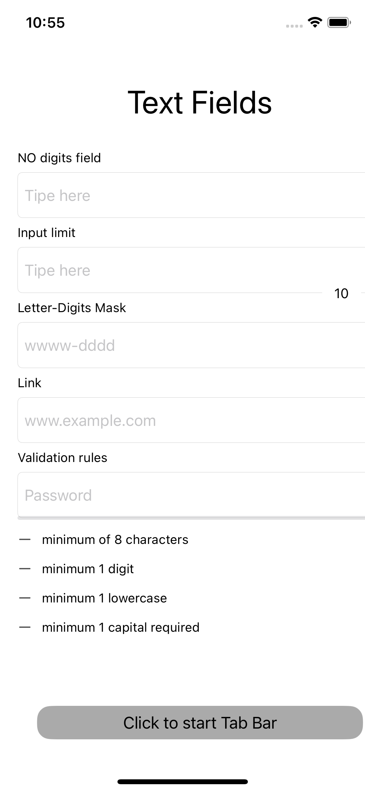
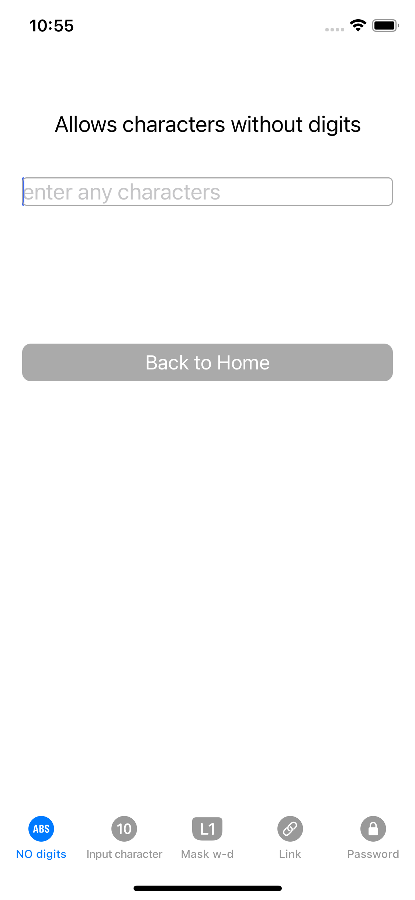
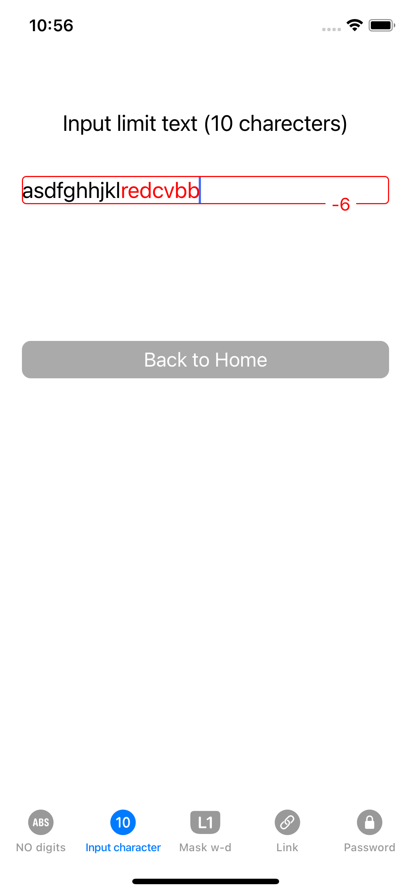
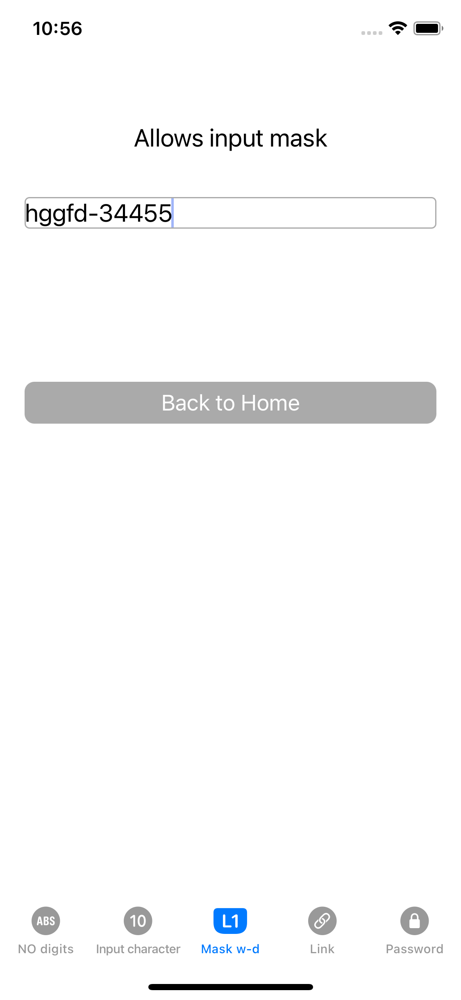
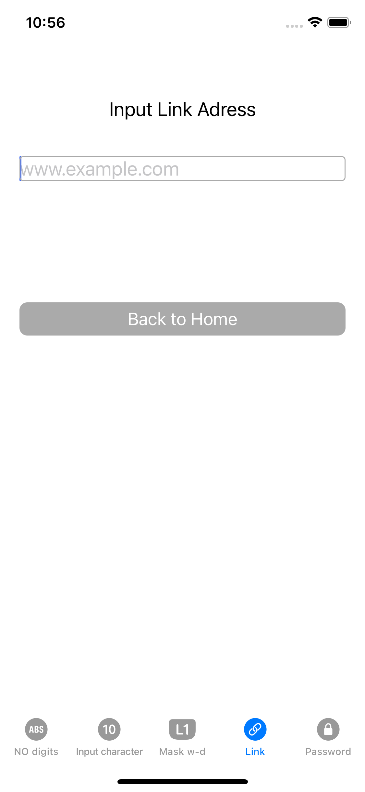
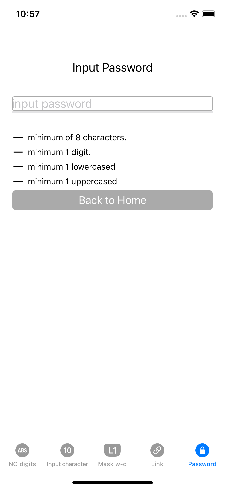
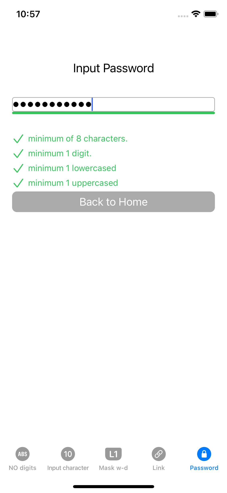

# Text fields rules App
Training app in which each field has its own data entry rules.

## Content
- [Technologies](#technologies)
- [Screenshots](#screenshots)
- [Contributing](#contributing)

## Technologies
- Swift
- UIKit
- Storyboard
- Auto Layout
- MVC
- UNIT/UI Tests

## Screenshots:

    

  

   

## Contributing
If you find a bug or remark in the code or when the program is running, please email me:
<a href="mailto:olga.sabadina@icloud.com">olga.sabadina@icloud.com</a>

### Why did I write this project?
___
This app was developed with the help of the knowledge gained during the mentoring course on [Foxminded](https://foxminded.ua)  Swift

